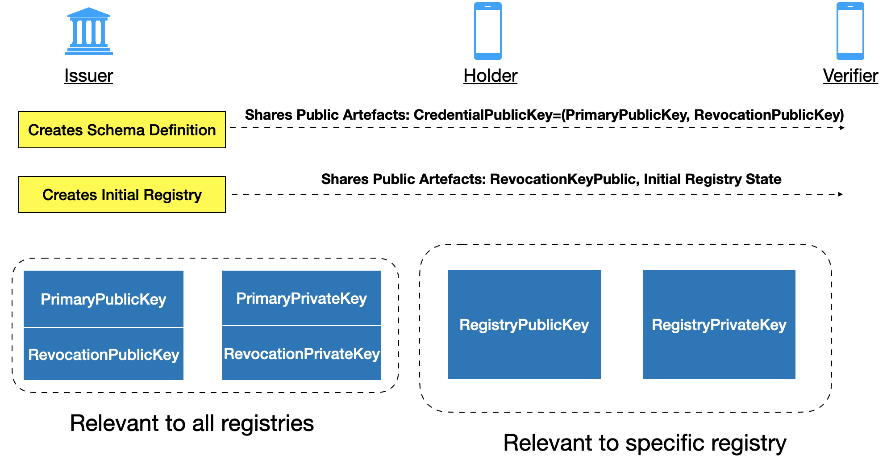
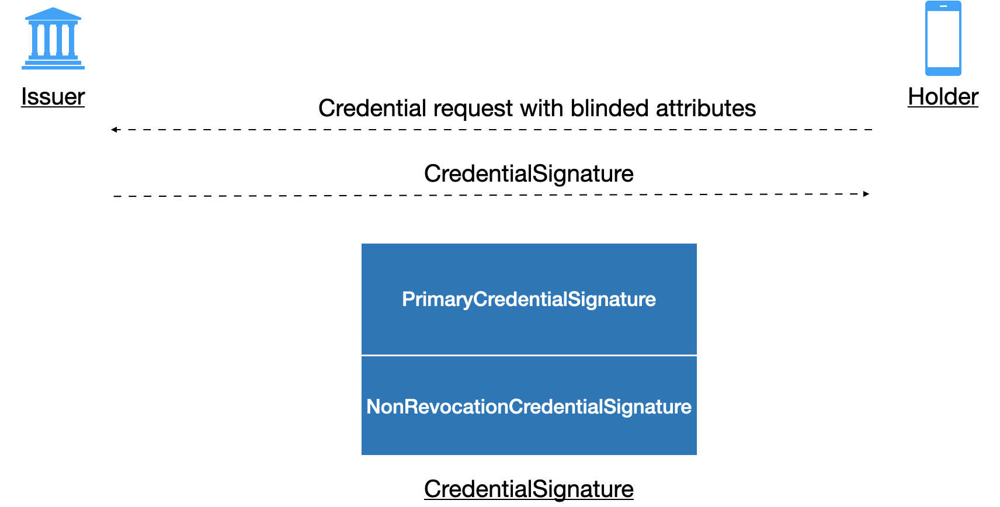
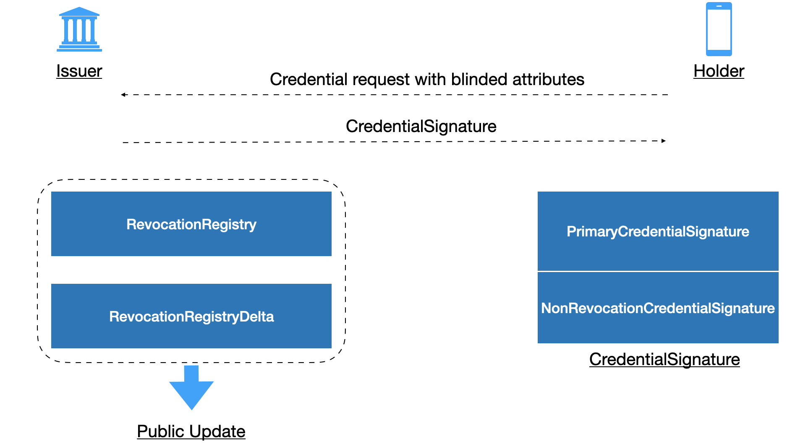

# Overview of Changes
## Schema and Registry Setup


The issuer creates artefacts (public and private) for a given 
schema definition and a revocation registry. The artefacts 
for a schema definition apply to all revocation registries for 
credentials issued for the schema. However, creation of a new 
revocation registry requires artefacts specific to it. In URSA, 
the relevant artefacts are:

- `CredentialPublicKey`: This class represents public artefacts created for 
a new schema definition. It consists of `CredentialPrimaryPublicKey` and 
`CredentialRevocationPublicKey` which are public artefacts for the 
primary signature scheme (CL) and revocation respectively.
- `CredentialPrivateKey`: This class represents private artefacts used by
the issuer. Again, they consist of `CredentialPrimaryPrivateKey` 
and `CredentialRevoctionPrivateKey`.
- `RevocationKeyPublic`: This represents the public key for a given 
revocation registry. It is associated with specific schema artefacts.
- `RevocationKeyPrivate`: This represents the private key for a given 
revocation registry. It is associated with specific schema artefacts.

The following functions are used by the issuer to create the above artefacts:

<table>
<tr>
<td>

```rust
pub fn new_credential_def(
        credential_schema: &CredentialSchema,
        non_credential_schema: &NonCredentialSchema,
        support_revocation: bool,
    ) -> UrsaCryptoResult<(
        CredentialPublicKey,
        CredentialPrivateKey,
        CredentialKeyCorrectnessProof,
    )>
```
</td>

<td>

```rust
pub fn new_revocation_registry_def(
    credential_pub_key: &CredentialPublicKey,
    max_cred_num: u32,
    issuance_by_default: bool,
) -> UrsaCryptoResult<(
    RevocationKeyPublic,
    RevocationKeyPrivate,
    RevocationRegistry,
    RevocationTailsGenerator,
)>
```
</td>
</tr>
</table>


### Changes to support new revocation
We first define new types for the new revocation scheme to extend the setup functionality.
```
CredentialPublicKey <--> CredentialPublicKeyVA
CredentialPrivateKey <--> CredentialPrivateKeyVA
RevocationKeyPublic  <--> RevocationKeyPublicVA
RevocationKeyPrivate <--> RevocationKeyPrivateVA
RevocationRegistry   <--> RevocationRegistryVA
SimpleTailsGenerator <--> NoOpRevocationTailsGenerator
```

Next, we introduce corresponding functions for the new revocation types:
<table>
<tr>
<td>CKS</td>
<td>  </td>
<td>VA</td>
</tr>

<tr>
<td>

```rust
 pub fn new_credential_def(
        credential_schema: &CredentialSchema,
        non_credential_schema: &NonCredentialSchema,
        support_revocation: bool,
    ) -> UrsaCryptoResult<(
        CredentialPublicKey,
        CredentialPrivateKey,
        CredentialKeyCorrectnessProof,
    )>
```

</td>

<td> <---> </td>

<td>

```rust
 pub fn new_credential_def_va(
        credential_schema: &CredentialSchema,
        non_credential_schema: &NonCredentialSchema,
        support_revocation: bool
    ) -> UrsaCryptoResult<(
        CredentialPublicKeyVA,
        CredentialPrivateKeyVA,
        CredentialKeyCorrectnessProof
    )>
```

</td>

</tr>

</table>

Next we define generic (wrapper) types which wrap the specific types such as:
```rust
pub enum GenCredentialPublicKey {
    CKS(CredentialPublicKey),
    VA(CredentialPublicKeyVA)
}

pub enum GenCredentialPrivateKey {
    CKS(CredentialPrivateKey),
    VA(CredentialPrivateKeyVA)
}
```

Finally, we define generic functions which delegate to the revocation specific functions by doing a match on 
the argument type:

```rust
   pub fn new_revocation_registry_generic(
        cred_pub_key: &GenCredentialPublicKey,
        max_cred_num: u32,
        issuance_by_default: bool,
        max_batch_size: u32
    ) -> UrsaCryptoResult<(
        GenRevocationKeyPublic,
        GenRevocationKeyPrivate,
        GenRevocationRegistry,
        AuxiliaryParams,
    )> {

        match cred_pub_key {
            GenCredentialPublicKey::CKS(cred_pub_key_cks) => {
                let (reg_key_public, reg_key_private, rev_reg, aux_params) =
                    Issuer::new_revocation_registry_def(
                        &cred_pub_key_cks,
                        max_cred_num,
                        issuance_by_default
                    )?;
                Ok((GenRevocationKeyPublic::CKS(reg_key_public),
                    GenRevocationKeyPrivate::CKS(reg_key_private),
                    GenRevocationRegistry::CKS(rev_reg),
                    AuxiliaryParams::CKS(aux_params)))
            },
            GenCredentialPublicKey::VA(cred_pub_key_va) => {
                let (reg_key_public, reg_key_private, rev_reg, aux_params) =
                    Issuer::new_revocation_registry_def_va(
                        &cred_pub_key_va,
                        max_cred_num,
                        max_batch_size
                    )?;
                Ok((GenRevocationKeyPublic::VA(reg_key_public),
                    GenRevocationKeyPrivate::VA(reg_key_private),
                    GenRevocationRegistry::VA(rev_reg),
                    AuxiliaryParams::VA(aux_params)
                ))
            },
            _ => Err(err_msg(UrsaCryptoErrorKind::InvalidStructure, "Invalid Credential Public Key"))
        }
    }
```
## Credential Issuance 



During credential issuance, the issuer creates an attestation object `CredentialSignature` which consists of attributes for 
the holder according to the credential schema. In addition, when a credential with revocation support is requested, the 
`CredentialSignature` object consists of:
- `PrimaryCredentialSignature`: which denotes the primary CL signature over the attributes.
- `NonRevocationCredentialSignature`: which denotes the non-revocation witness for the credential.

Apart from creating the credential signature, the issuer also generates public artefacts (i) `RevocationRegistry` which 
denotes the new state of registry (accumulator value) and (ii) `RevocationRegistryDelta` which is the information used by holders
to update their witness to the new accumulator state. In Ursa, the following function completes a credential issuance with revocation:

```rust
 pub fn sign_credential_with_revoc<RTA>(
        prover_id: &str,
        blinded_credential_secrets: &BlindedCredentialSecrets,
        blinded_credential_secrets_correctness_proof: &BlindedCredentialSecretsCorrectnessProof,
        credential_nonce: &Nonce,
        credential_issuance_nonce: &Nonce,
        credential_values: &CredentialValues,
        credential_pub_key: &CredentialPublicKey,
        credential_priv_key: &CredentialPrivateKey,
        rev_idx: u32,
        max_cred_num: u32,
        issuance_by_default: bool,
        rev_reg: &mut RevocationRegistry,
        rev_key_priv: &RevocationKeyPrivate,
        rev_tails_accessor: &RTA,
    ) -> UrsaCryptoResult<(
        CredentialSignature,
        SignatureCorrectnessProof,
        Option<RevocationRegistryDelta>,
    )>
```
### Supporting Changes
As before, we introduce following new types and generic types:

| CKS  (Existing)           | VA    (New)                 | Generic      (New)           |
|---------------------------|-----------------------------|------------------------------|
| `CredentialSignature`     | `CredentialSignatureVA`     | `GenCredentialSignature`     |
| `RevocationRegistryDelta` | `RevocationRegistryDeltaVA` | `GenRevocationRegistryDelta` |

The following function is introduced that allows creation of generic signatures with either revocation scheme

<table>
<tr>
<td>CKS (Existing)</td>
<td>Genetic (New)</td>
</tr>

<tr>
<td>

```rust
 pub fn sign_credential_with_revoc<RTA>(
    prover_id: &str,
    blinded_credential_secrets: &BlindedCredentialSecrets,
    blinded_credential_secrets_correctness_proof: 
        &BlindedCredentialSecretsCorrectnessProof,
    credential_nonce: &Nonce,
    credential_issuance_nonce: &Nonce,
    credential_values: &CredentialValues,
    credential_pub_key: &CredentialPublicKey,
    credential_priv_key: &CredentialPrivateKey,
    rev_idx: u32,
    max_cred_num: u32,
    issuance_by_default: bool,
    rev_reg: &mut RevocationRegistry,
    rev_key_priv: &RevocationKeyPrivate,
    rev_tails_accessor: &RTA,
) -> UrsaCryptoResult<(
    CredentialSignature,
    SignatureCorrectnessProof,
    Option<RevocationRegistryDelta>,
)>
```
</td>

<td>

```rust
pub fn sign_credential_with_revoc_generic<RTA>(
    prover_id: &str,
    blinded_credential_secrets: &BlindedCredentialSecrets,
    blinded_credential_secrets_correctness_proof: 
        &BlindedCredentialSecretsCorrectnessProof,
    credential_nonce: &Nonce,
    credential_issuance_nonce: &Nonce,
    credential_values: &CredentialValues,
    credential_pub_key: &GenCredentialPublicKey,
    credential_priv_key: &GenCredentialPrivateKey,
    rev_idx: u32,
    max_cred_num: u32,
    issuance_by_default: bool,
    rev_reg:&mut GenRevocationRegistry,
    reg_priv_key: &GenRevocationKeyPrivate,
    rev_tails_accessor: &RTA,
) -> UrsaCryptoResult<(
    GenCredentialSignature,
    SignatureCorrectnessProof,
    Option<GenRevocationRegistryDelta>
)>
```
</td>
</tr>
</table>

## Witness Management


The holder needs to update its witness to the current state of the revocation registry. It does so by applying the 
updates published by the issuer in the form of `RevocationRegistryDelta` to the witness. Alternatively, the holder
can merge the `RevocationRegistryDelta` objects to cumulatively apply the update. The generic interface does not 
cleanly handle the witness update related operations, as they are substantially different between the two revocation 
schemes. 

In the CKS scheme, the witness represented by the class `Witness` is not computed by the issuer, but instead 
computed by the holder itself using the public parameters (specifically the tails). Subsequently, the witness 
can be updated by applying the `RevocationRegistryDelta`.

```rust
// initialize witness
 let mut witness = Witness::new(
                    rev_idx,
                    max_cred_num,
                    issuance_by_default,
                    &rev_reg_delta_init_cks,
                    &simple_tails_accessor,
                ).unwrap();

// update CKS witness. We need to unwrap the generic type 
// to specific CKS type, as update is specific to scheme.
prover_data[i].3.as_mut().unwrap().unwrap_cks().unwrap().update(
rev_idx,
max_cred_num,
&revoke_delta,
&simple_tails_accessor
).unwrap();
```

In the new (VA) accumulator scheme, no witness initialization is required, as it is computed (and can only be computed) 
by the issuer. We embed the witness as part of the non-revocation credential itself. The witness update only requires 
the corresponding registry delta `RevocationRegistryDeltaVA` and a helper vector of lagrangian coefficients to 
help in applying the update.

```rust
// again we need to unwrap the generic type to specific type
prover_data[i].2.unwrap_va().unwrap().r_credential.as_mut().unwrap().witness.update(
                    &revoke_delta,
                    &ldomain
                ).unwrap();
```
In the above, the `GenCredentialSignature` type is downgraded to `CredentialSignatureVA` using `unwrap_va()` and 
then the mutable reference to the contained revocation credential `r_credential` which contains the witness is 
obtained. 

## Proof Presentation


## Benchmarks
### Issuer Operations 
#### Registry Definition ( `max_cred_num=100,000`):
This is a one type operation performed by the issuer when initializing a 
new revocation registry. Here we consider the maximum number of 
credentials in the registry `max_cred_num` as 100000.

| Revocation Type | Repetitions | Time (s) |
|-----------------|-------------|----------|
| CKS             | 1           | 126.2    |
| VA              | 1           | 52.7     |

#### Issue Credential with Revoc (`max_cred_num=100,000`):
This operation is performed by the issuer, every time a 
new credential is issued.

| Revocation Type | Repetitions | Time (s) |
|-----------------|-------------|----------|
| CKS             | 1000        | 113.4    |
| VA              | 1000        | 131.5    |

#### Computing Registry Delta (`batch_size=100`):
This operation is performed by the issuer, whenever the state 
of the registry changes, i.e, credentials are issued or revoked.
In the CKS scheme, the state of registry changes both on issue and revocations
if `issuance_by_default` is set to `false`. Otherwise, the state 
only changes when credentials are revoked. This is the setting
for CKS scheme we consider in the benchmarks. For the VB accumulaor 
based revocation, the state of the registry only changes when 
credentials are revoked. The time(s) below indicate how long it 
takes for the issuer to compute "revocation update" for both schemes,
when the update size is 100.

| Revocation Type | Repetitions | Time (ms) |
|-----------------|-------------|-----------|
| CKS             | 10          | 2.3       |
| VA              | 10          | 245       |

### Prover Operations

#### Process Credential Signature:
This operation is performed by the prover whenever it 
receives a signature from the issuer. In the CKS scheme
it needs to update it's witness to the current registry 
state, as that is not done by the issuer. In case of VB
based scheme, there is only a minor adjustment to primary signature,
as is the case in CKS scheme too.

| Revocation Type | Repetitions | Time (s) |
|-----------------|-------------|----------|
| CKS             | 100         | 24.7     |
| VA              | 100         | 0.0      |

#### Update Witness (batch_size=100):
This operation is performed by the prover, every time it 
needs to update its witness to be consistent with the latest 
registry state. It does it by applying the `deltas` published by
the issuer. It must be performed before generating a presentation against 
latest registry state.

| Revocation Type | Repetitions | Time (ms) |
|-----------------|-------------|-----------|
| CKS             | 1000        | 2.5       |
| VA              | 100         | 92.1      |

#### Generate Proofs:
This operation is performed by the prover whenever it wants 
to generate a presentation attesting to some verification predicate.


| Revocation Type | Repetitions | Time (s) |
|-----------------|-------------|----------|
| CKS             | 100         | 5.3      |
| VA              | 100         | 3.74     |

### Verifier Operations

#### Verify Presentation:
This operation is performed by the verifier to check prover's
presentation satisfies the verification predicate.

| Revocation Type | Repetitions | Time (s) |
|-----------------|-------------|----------|
| CKS             | 100         | 4.86     |
| VA              | 100         | 2.31     |
